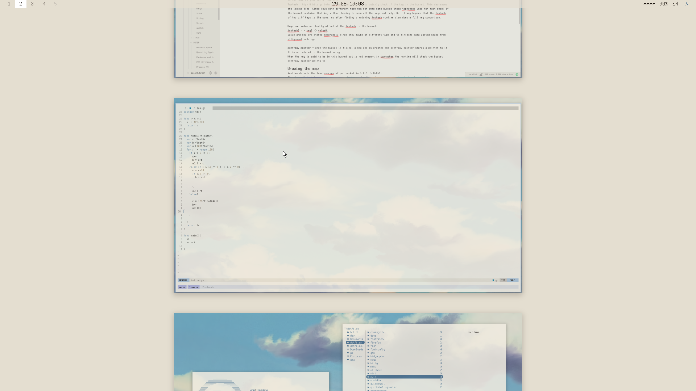

# laniakea

**Sky Paper** — a warm, painterly light rice: [niri](https://github.com/YaLTeR/niri)
+ Quickshell on Arch, on a ThinkPad X280. Cream base, two sky accents, bitmap
fonts, no dark mode.




## Deploy

```sh
git clone -b laniakea git@github.com:purgatoriumlautus/sky-paper.git ~/dotfiles
stow -d ~/dotfiles -t ~ <module>      # each $HOME module
sudo ~/dotfiles/<module>/install.sh   # each system module
```
