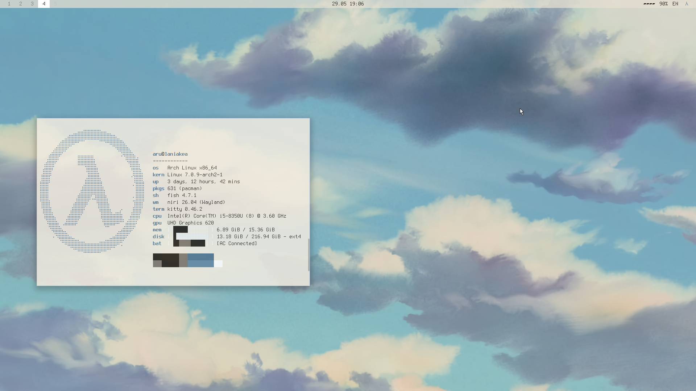
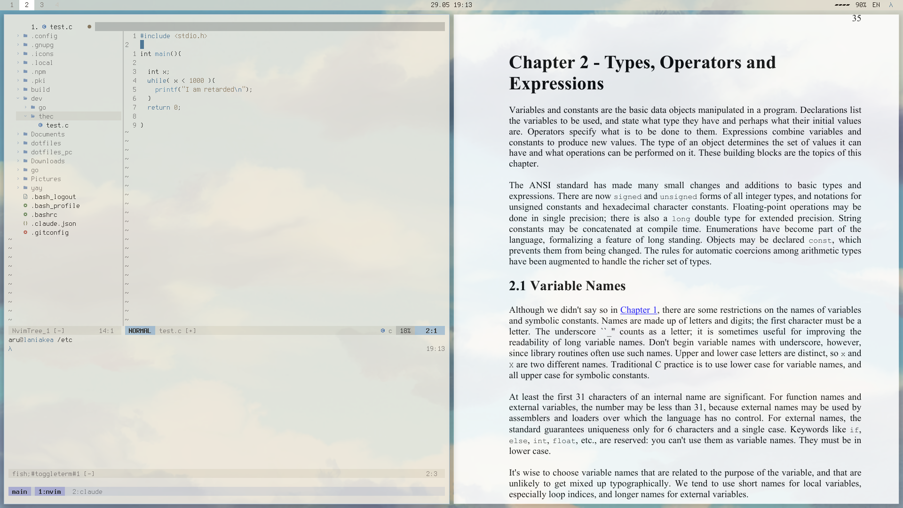
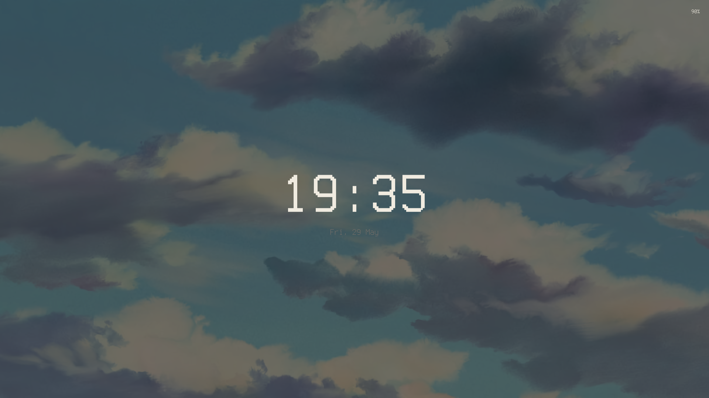
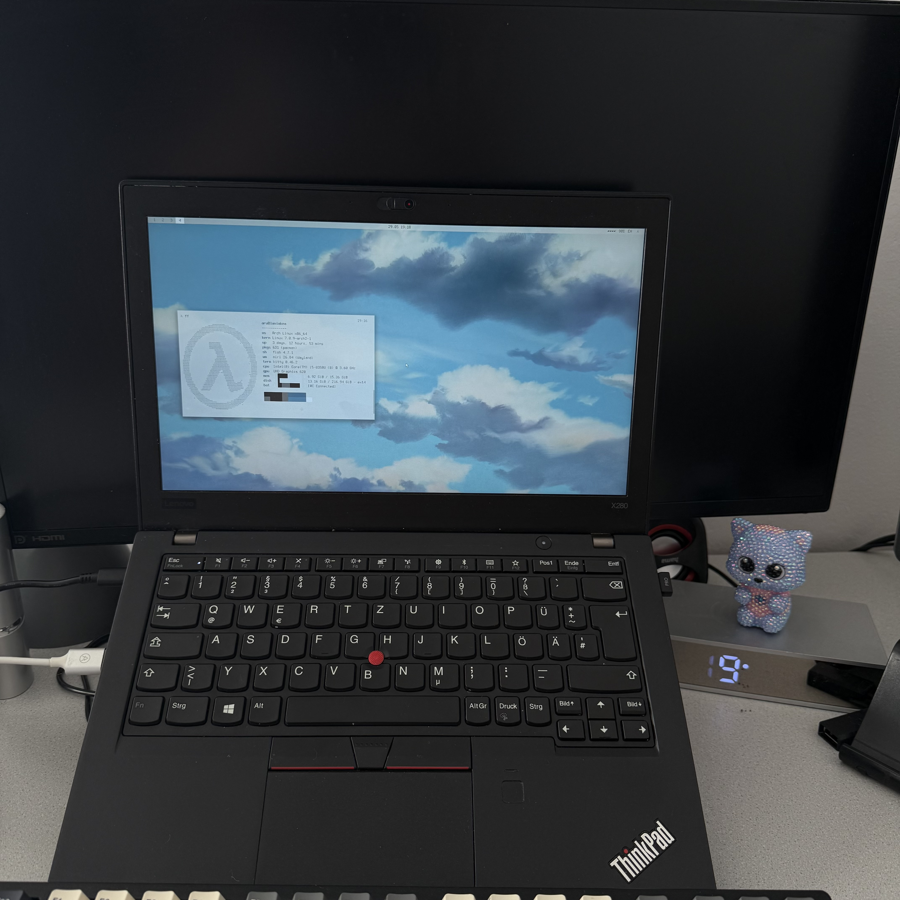

# laniakea

**Sky Paper** — a warm, painterly light rice. Soft Ghibli clouds behind a crisp
bitmap-font desktop on [niri](https://github.com/YaLTeR/niri). Cream base, two
sky accents, no dark mode.

## Desktop

|              |                                          |
| ------------ | ---------------------------------------- |
| WM           | niri (scrollable tiling)                 |
| Shell UI     | Quickshell — bar · launcher · lock · greeter |
| Terminal     | kitty                                    |
| Editor       | nvim                                     |
| Shell        | fish                                     |
| Multiplexer  | tmux                                     |
| Files        | yazi                                     |
| Notifications| mako                                     |
| Documents    | zathura                                  |
| Fonts        | Terminus · Terminess · Unifont (bitmap)  |

## System

|           |                                  |
| --------- | -------------------------------- |
| Firewall  | nftables                         |
| Hardening | sshd · sysctl drop-ins           |
| Power     | tlp · swayidle                   |
| Input     | keyd (CapsLock → leader)         |
| Boot      | crossgrub (themed GRUB)          |

## Gallery

Scrollable workspaces — the niri overview.

A working scene — nvim, yazi, zathura.

Lock — clock-first over the clouds.

## Palette

Sky Paper, a custom warm-cream + cool-sky scheme:

`#F0EBE0` cream · `#1F1812` ink · `#A8C0D5` sky · `#4A6F8E` deep sky · `#8B6F4E` clay

Full breakdown — roles, contrast ratios, per-tool mappings — in [PALETTE.md](PALETTE.md).

## Setup

Per-package layout. `$HOME` configs are managed with [GNU Stow](https://www.gnu.org/software/stow/);
root-owned bits (`/etc`) are installed by a per-package `install.sh`. The
wallpaper lives in [`wallpapers/clouds.png`](wallpapers/clouds.png).

Tuned for a ThinkPad X280 (niri on eDP-1, scale 1) — adapt paths and hardware
specifics before use.

---

In the wild — the X280 itself.

